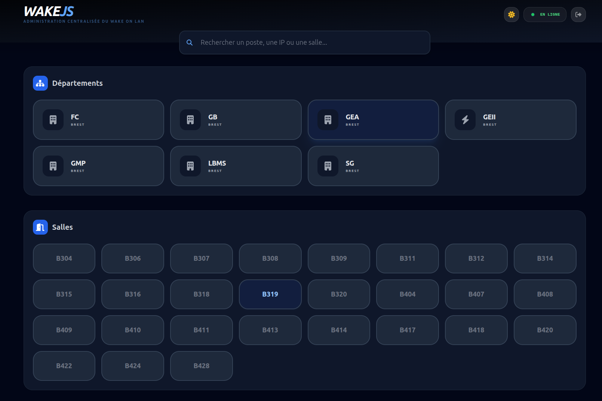

# 🖥️ WakeJS - Gestion centralisée Wake-on-LAN

Application web full-stack pour le démarrage à distance d'un parc informatique, organisée par site, département et salle. Conçue pour les environnements multi-VLAN avec authentification Active Directory.

## Vue d'ensemble

WakeJS permet aux administrateurs système de **réveiller, pinguer ou éteindre** des postes de travail à distance depuis une interface web, sans aucun accès physique. Le système lit la configuration des hôtes depuis un fichier ISC DHCP et envoie des **paquets magiques Wake-on-LAN** sur le réseau local.

<p align="center">
  
</p>

```
wakejs/
├── backend/                    # API REST Node.js / Express
│   ├── config/
│   │   ├── config.json         # Configuration serveur (VLAN, SSH, AD, WoL)
│   │   └── dhcp-template.conf  # Définitions des hôtes (MAC, IP, salle)
│   └── src/
│       ├── index.js            # Point d'entrée, bootstrap Express
│       ├── routes/
│       │   └── apiRoutes.js    # Déclaration des routes API
│       ├── controllers/
│       │   └── actionController.js
│       ├── middlewares/
│       │   ├── auth.js         # Vérification JWT
│       │   └── validator.js    # Validation des payloads
│       └── services/
│           └── loggerService.js  # Logger fichier + console coloré
├── frontend/                   # Interface web statique
│   ├── index.html              # Page principale
│   └── assets/
│       ├── js/
│       │   ├── app.js          # Point d'entrée frontend
│       │   ├── api.js          # Appels HTTP vers le backend
│       │   ├── theme.js        # Gestion dark/light mode
│       │   └── components/
│       │       ├── navigation.js  # Sélection département/salle
│       │       ├── hosts.js       # Rendu et actions sur les postes
│       │       └── search.js      # Recherche globale
│       ├── config/
│       │   ├── config.json     # Configuration frontend (API, UI, sites)
│       │   └── rooms.json      # Mapping départements → salles → hôtes
│       └── style/
│           └── style.css       # Styles personnalisés (complément Tailwind)
└── scripts/
    ├── wakejs.sh               # Script de démarrage
    └── diagnostic.sh          # Utilitaire de diagnostic réseau
```

## Stack technique

| Couche            | Technologie                                 |
| ----------------- | ------------------------------------------- |
| Backend           | Node.js, Express                            |
| Auth              | JWT + Active Directory (LDAP)               |
| Frontend          | HTML, Tailwind CSS, Vanilla JS (ES Modules) |
| Réseau            | Wake-on-LAN (UDP), ICMP Ping, SSH           |
| Arrêt distant     | `sshpass` + `sudo shutdown`                 |
| Gestion des hôtes | Parsing de config DHCP ISC                  |
| Logs              | Fichier + console (coloré)                  |

## Architecture réseau

Le projet gère deux VLAN avec résolution automatique de l'adresse broadcast selon l'IP de chaque hôte :

| VLAN         | Plage                           | Broadcast        |
| ------------ | ------------------------------- | ---------------- |
| Gestion      | `172.18.53.x` → `172.18.59.x`   | `172.18.60.255`  |
| Enseignement | `172.18.240.x` → `172.18.247.x` | `172.18.240.255` |

## Prérequis

- Node.js ≥ 18
- `sshpass` installé sur le serveur WakeJS
- Accès réseau UDP port 9 (WoL) vers les machines cibles
- Wake-on-LAN activé dans le BIOS des machines cibles
- Accès LDAP au contrôleur de domaine Active Directory
- Compte de service avec droits `sudo shutdown` sur les machines gérées

## Installation rapide

```bash
git clone https://github.com/cristianmeyers/wakejs.git
cd wakejs/backend
npm install
```

Configurer `backend/config/config.json` (VLAN, AD, SSH) puis lancer :

```bash
bash scripts/wakejs.sh
```

L'API écoute par défaut sur `http://0.0.0.0:3000`.

## Documentation détaillée

| Fichier                                                                | Description                                                |
| ---------------------------------------------------------------------- | ---------------------------------------------------------- |
| [`backend/README.md`](backend/README.md)                               | Installation, variables d'environnement, référence API     |
| [`backend/config/README.md`](backend/config/README.md)                 | Options de `config.json` et format `dhcp-template.conf`    |
| [`frontend/README.md`](frontend/README.md)                             | Architecture frontend, composants, flux d'authentification |
| [`frontend/assets/config/README.md`](frontend/assets/config/README.md) | Options de `config.json` et structure de `rooms.json`      |
| [`backend/src/README.md`](backend/src/README.md)                       | Rôle de chaque fichier source backend                      |

## Licence

MIT
